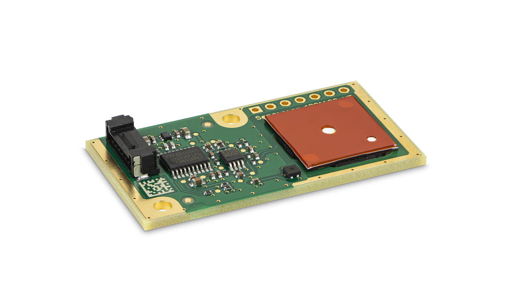
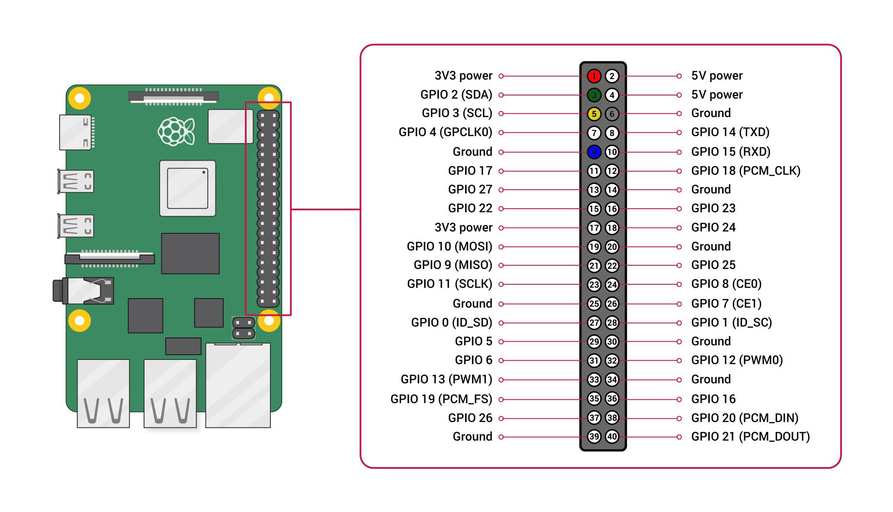

# Sensirion Raspberry Pi I2C SFA3x Driver

This document explains how to set up the [SEK-SFA3x](https://www.sensirion.com/my-sfa-ek) sensor module to run on a
Raspberry Pi using the provided code.

[<center></center>](https://www.sensirion.com/my-sfa-ek)

## Setup Guide

### Connecting the Sensor

Your sensor has seven different connectors: VCC, GND, SDA, SCL, SEL (the sixth and seventh connector will not be used
for now). Use the following pins to connect your SFA3x:

*SFA3x*  |    *Raspberry Pi*            |   *Jumper Wire*   |
 :------: | :-------------------------: | :---------------: |
VCC    |        Pin 1 or 2 (3.3V or 5V) |   Red             |
GND    |        Pin 6                   |   Black           |
SDA    |        Pin 3                   |   Green           |
SCL    |        Pin 5                   |   Yellow          |
SEL    |        Pin 9 (GND for I2C)     |   Blue            |

<center></center>

If you don't have a suitable cable at hand, please find the SEK-SFA3x pinout listed below, or in
the [datasheet](https://www.sensirion.com/fileadmin/user_upload/customers/sensirion/Dokumente/14_Formaldehyde_Sensors/Datasheets/Sensirion_Formaldehyde_Sensors_SFA30_Datasheet.pdf):

| *Pin* | *Name* | *Description* | *Comments* |
|-------|--------|---------------|------------|
| 1     | VDD    | Supply Voltage | 5V ±10%
| 2     | GND    | Ground |
| 3     | RX     | UART: Receiving pin for communication |
|       | SDA    | I2C: Serial data input / output |
| 4     | TX     | UART: Transmission pin for communication |
|       | SCL    | I2C: Serial clock input |
| 5     | SEL    | Interface select | Leave floating or pull to VDD to select UART
|       |        |  | Pull to GND to select I2C
| 6     | NC     | Do not connect |
| 7     | NC     | Do not connect |

### Raspberry Pi

- [Install the Raspberry Pi OS on to your Raspberry Pi](https://projects.raspberrypi.org/en/projects/raspberry-pi-setting-up)
- [Enable the I2C interface in the raspi-config](https://www.raspberrypi.org/documentation/configuration/raspi-config.md)
- Download the driver for the [Sensirion Github Page](https://github.com/Sensirion/raspberry-pi-i2c-sfa3x) and extract
  the `.zip` on your Raspberry Pi
- Compile the driver
    1. Open a [terminal](https://www.raspberrypi.org/documentation/usage/terminal/?)
    2. Navigate to the driver directory. E.g. `cd ~/raspberry-pi-i2c-sfa3x`
    3. Run the `make` command to compile the driver

       Output:
       ```
       rm -f sfa3x_i2c_example_usage
       cc -Os -Wall -fstrict-aliasing -Wstrict-aliasing=1 -Wsign-conversion -fPIC -I. -o sfa3x_i2c_example_usage  sfa3x_i2c.h sfa3x_i2c.c sensirion_i2c_hal.h sensirion_i2c.h sensirion_i2c.c \
       	sensirion_i2c_hal.c sensirion_config.h sensirion_common.h sensirion_common.c sfa3x_i2c_example_usage.c
       ```
- Test your connected sensor
    - Run `./sfa3x_i2c_example_usage` in the same directory you used to compile the driver.

      Output:
      ```
      Device marking: 494108010320N020234S
      Formaldehyde concentration: 0.0 ppb
      Relative humidity: 35.35 %RH
      Temperature: 25.28 °C
      Formaldehyde concentration: 0.0 ppb
      Relative humidity: 35.34 %RH
      Temperature: 25.26 °C
      Formaldehyde concentration: 0.0 ppb
      Relative humidity: 35.36 %RH
      Temperature: 25.28 °C
      Formaldehyde concentration: 0.0 ppb
      Relative humidity: 35.34 %RH
      Temperature: 25.28 °C
      ...
      ```

## Troubleshooting

### Initialization failed

- Ensure that you connected the sensor correctly: All cables are fully plugged in and connected to the correct pin.
- Ensure that I2C is enabled on the Raspberry Pi. For this redo the steps on
  "Enable the I2C interface in the raspi-config" in the guide above.
- Ensure that your user account has read and write access to the I2C device. If it only works with user
  root (`sudo ./sfa3x_i2c_example_usage`), it's typically due to wrong permission settings.
